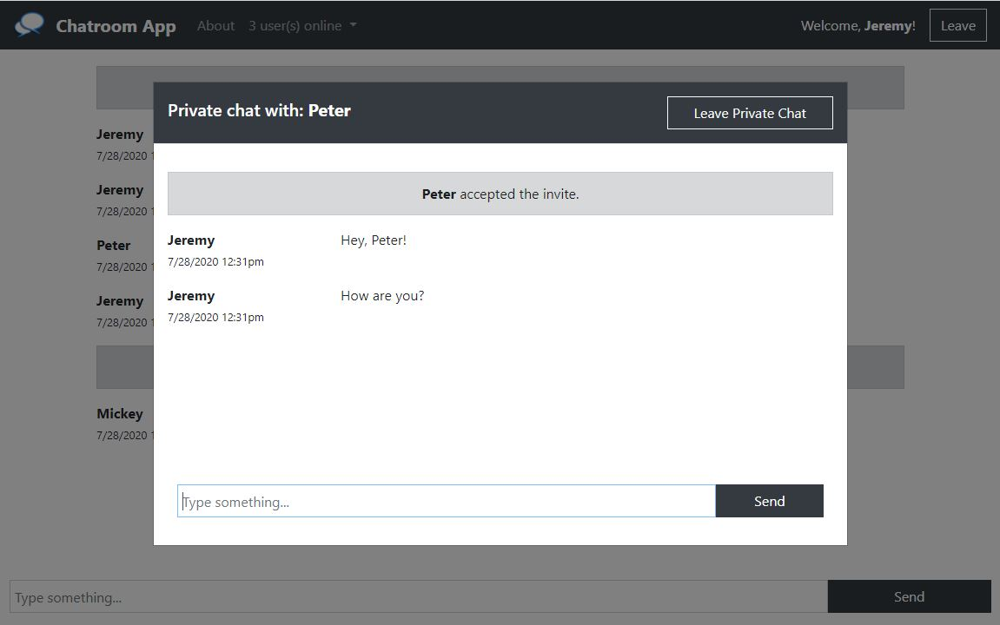

# Chatroom App

### Project Description

[Chatroom App](https://flask-chatroom-app.herokuapp.com) is a simple chatroom application created using Flask and Socket.IO. It has one main room for everybody connected to the server, and each user can send private messages to a specific user.

### Languages/Frameworks/Libraries Used

**Flask** was used to handle server-side code and routes, and **HTML**, **Bootstrap**, and **JavaScript** (with **jQuery**) was used for client-side code and website designs. To handle the multiple connections and communication between clients, I used the **SocketIO extension** that works with Flask, and the **Socket.IO library** that works with JavaScript.

---

### Joining the Chatroom

Go to the [join page](https://flask-chatroom-app.herokuapp.com/join), enter in a username, and click on the `Join` button to enter the main chatroom. A username is required to join, and each username must be unique (case sensitive).

### Main Chatroom

Once you've joined, you can chat with other users by typing in a message in the input box and clicking `Send`. You can view all messages that were sent after you joined, including notifications about who joined/left the room.

### Private Chat

On the top navigation bar, you can find the number of users online as well as their usernames. By clicking on a username (other than yourself), you can invite a specific user to a private chat that can only be seen by you and that user. The user can either accept or decline the invite by clicking `OK` or `Cancel` on the confirm box that will pop up.

---

### Credits

Logo image by [Clker-Free-Vector-Images](https://pixabay.com/users/Clker-Free-Vector-Images-3736/?utm_source=link-attribution&amp;utm_medium=referral&amp;utm_campaign=image&amp;utm_content=35342) from [Pixabay](https://pixabay.com/?utm_source=link-attribution&amp;utm_medium=referral&amp;utm_campaign=image&amp;utm_content=35342)